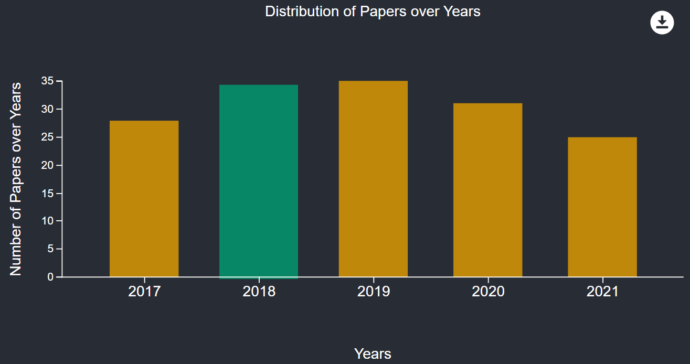

# Visulite

<strong>Visulite</strong> (Visualization of Literature) is a react webpage to enable researchers have a better overview of scientific literatures in a graphical presentation focusing on the specification in the work of [Konersmann et al.](https://gitlab.com/SoftwareArchitectureResearch/StateOfPractice).

## Getting Started

If you want to try running the system the following information may be helfpul:

### Installation

For this project following versions were used:

- [Node.js 18.12.1](https://nodejs.org/en/blog/release/v18.12.1)
- [npm 9.6.6](https://www.npmjs.com/package/npm/v/9.6.6)

### Launch the System

In order to be able to run the system you need an editor such as visual studio code or a any command line editor

- First, go to the root of the project `../visulite`.
- Second, run `npm install` in order to install all the necessary dependencies for the project.
- Once the installation is complete, run `npm run start`.
- The webpage should be opened in `https://localhost:3000`. If this step did not occur automatically, you can open your navigator and enter the aforementioned address.

## About the System

### Structure

The project is composed of three main subsystems. the following diagram shows the main components and the relevant flow of data between components, that will be discussed below.

#### Data

This part is composed of the `internal model` depicted in the diagram below to which a `bib` file will be parsed and from which the different charts as well as the table can be generated.

In the diagram above a `BibWrapper` is composed of `BibEntry`, which is an object mapped using an external dependency [bib-parser](https://www.npmjs.com/package/bibtex-parser) and contains the usual bibtex entries and `LiteratureClasses`. The latter is a mapping of the structure described in [Konersmann et al.](https://gitlab.com/SoftwareArchitectureResearch/StateOfPractice)' s work.
Attributes that have the same name as their type are of type enum and were not completely represented to reduce the complexity of the diagram.
Enums were mostly chosen as types in order to make parsing and drawing charts easier.

#### Services

As shown in the diagram below, this layer comprises the different data processing steps before the data is provided for visualization.

- In this layer, data are imported from a given `.bib` File with the structure described in [Konersmann et al.](https://gitlab.com/SoftwareArchitectureResearch/StateOfPractice)'s work.
- The resulting string is then input for the parser, which transforms it to the internal model described in the [data](#data) paragraph.
- After the parsing is accomplished, the model should be available for all the page components and saved in a consistent way for all elements. Consequently, it will be placed in a react store.
- The data saved in the store will then be used for generating table rows and chart input

In addition to the data processing, the logic for rendering chart can also be found in this layer, in the `drawChart` service.

#### User Interface (Component Rendering)

The User Interface comprises the component `CurrentChart` representing the currently rendered [charts](#charts) and all the UI components used in the web page and relevant logic for state and data transfer between components:
e.g., upon a click on a bar in the `BarChart` component, the `Table` component should be updated accordingly in a way that it only shows the item value represented by the clicked bar.

For instance, in the images below we consider a bar chart representing the distribution of papers over years. If we click on the bar representing the years 2018, only papers of that year should be displayed in the table below. (Color of bar follows hovering effect and not selection effect).

The most relevant user Interface components are the charts, the Table and MUI selector (`SelectOptions`):

- The [chart](#charts) components developed with [d3.js](https://d3js.org/) and `CurrentChart` in which they are rendered.
- The [table](#table) component developed mainly using the [MUI](https://mui.com/) library.
- The [MUI Selector](#mui-selector)

##### Charts

Currently, three chart components were implemented. These are:

- Bar Chart
- Pie Chart
- Bubble Chart

since all of them are drawn using d3.js, the three diagrams present a similar structure and share a `.css` file for styling code that could be extracted there and thus helped to have a unified style between charts. All of the three charts can dynamically be interchanged using the `ChartDrawer` depicted in the flow diagram below.
Through props, `currentChart` receives necessary data to render chart (chart type, paper data and dimensions) and a setter to change the content of table upon selection of chart element.

##### Table

In this component an overview of the papers is represented in order to offer more contextual information for the user.
The content of the table can be influenced by the chart as described above.
As shown in the image in the [UI section](#user-interface-layer-component-rendering) above.

Moreover, the table can be filtered, modified and exported using the buttons available in its header.
Note that this menu is slightly customized by adding the `Clear Selection` button. The latter allows to clear the selection described in [charts](#charts) section.

As a result, data that the table receives are mainly, the papers to be represented, a list of the remaining papers to be shown after selecting a chart item and the same setter charts receive in order to be able to clear their selection.

##### MUI Selector

Using the Selector (`SelectOptions`) component, the user can choose the type of chart to be visualized as well as the data to be calculated. The selector component decides based on the selected chart type, whether one or two selectors are needed for calculating the chart input. If two selectors are needed, the chart data calculation will be run twice (first using store data and first selected item and second using the result of the first run and second selected item). (This can be seen as a composition of a function)

The Selector component receives two setters from the Layout, with which it can set the calculated chart input and chart type that are saved in the Layout component as state

### Feature Summary

With this page you can import any bibtex file extended as described in the work of [Konersmann et al.](https://gitlab.com/SoftwareArchitectureResearch/StateOfPractice).
The developed program will then

- Transform the data into an <strong>internal reusable model</strong>
- Visualize the data in different types of <strong>charts </strong>(currently PieChart, BarChart and BubbleChart but extensible with other chart types) and switch between them.
- Choose the data of interest to be visualized (currently paper classes, evaluation methods and years can also be extended with the different information that the internal model provides)
- Visualize the data in table that presents more extensive information about the papers.
- Filter the visualized data in the table through the charts or through en embedded filter in the table
